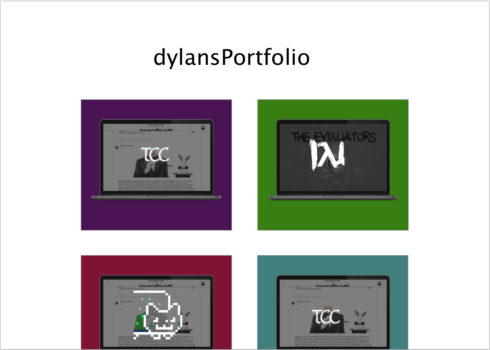

# Portfolio

## Sections
* Header
* About
* First Animation
* Portfolio
* Second Animation
* Contact Form

## Proposed change as of 2/19

## Current Concerns
* Lots of business logic in components. Currently in the process of factoring out logic for animations given the weight of the components.  Regarding the other components, given the small scope of the project I don't see the logic being a problem.   If projects expands more it may be a good idea to seperate logic.  Could possibly even use a lightweight store controller like Mobx.
* Currently working on new file structure so folders may seem a bit random in the intermediary